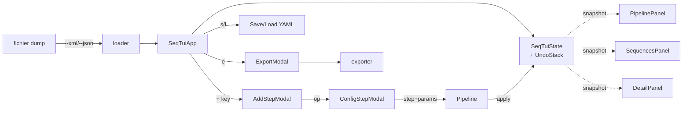

# cod3s-seq — TUI d'analyse interactive des séquences PyCATSHOO

## Overview

Nouveau binaire console `cod3s-seq` (Textual TUI) qui charge un dump de séquences PyCATSHOO (XML brut ou JSON cod3s), permet d'empiler interactivement des opérations du pipeline d'analyse (`group_sequences`, `filter_objfm_cycles`, `compute_minimal_sequences` plus 3 primitives low-level), visualise la séquence courante en 3 panneaux (pipeline / liste / détail), supporte undo/redo, sauvegarde/charge le pipeline configuré en YAML, et exporte les séquences résultantes en JSON cod3s + CSV + Markdown.

Cible mixte : R&D (auditer / déboguer / calibrer les algos) **et** analyste sûreté (charger un dump d'étude, voir les minimales).

## Problem Statement

Le pipeline d'analyse des séquences a été stabilisé dans cod3s 1.4.0 (auto-discovery ObjFM, filtrage symétrique internal/external, ~2× speedup). Aujourd'hui, **observer finement ce que chaque étape produit** demande d'écrire du code ad-hoc (cf. `examples/ccf_sequence_asymmetry/`). Pour comparer deux configurations de paramètres ou voir l'effet d'un `rm_events_ordered_pattern` custom, on doit relancer le script entier.

Côté analyste sûreté, le binaire actuel `run-cod3s-study` produit `sequences_minimal.json` et `sequences_all.json` mais il n'existe **pas d'outil interactif** pour les inspecter (filtrer, drill-down, exporter en Markdown pour un rapport). Les analystes ouvrent le JSON dans un éditeur texte.

Le brainstorm `docs/brainstorms/2026-05-17-seq-tui-brainstorm.md` a tranché : un seul outil hybride, post-mortem fichier, pipeline linéaire empilable + undo, 3 panneaux, 6 opérations exposées.

## Proposed Solution

### Architecture (vue d'ensemble)

```
cod3s/pycatshoo/seq_tui/
├── __init__.py        # exports publics, pas de version privée
├── app.py             # SeqTuiApp (Textual App)
├── state.py           # SeqTuiState + UndoStack
├── panels.py          # PipelinePanel, SequencesPanel, DetailPanel
├── modals.py          # AddStepModal, ConfigStep*Modal (un par op), SaveModal, LoadModal, ExportModal
├── loader.py          # load_sequences_from_xml(), load_sequences_from_json_cod3s()
├── exporter.py        # export_json_cod3s(), export_csv(), export_markdown()
├── pipeline.py        # PipelineStep (Pydantic discriminated union), Pipeline.apply/save_yaml/load_yaml
└── styles.tcss        # CSS Textual

cod3s/pycatshoo/sequence.py
└── + persist_sequence_analysis_artifacts()  # extracted from study_runner, public

cod3s/scripts/run_cod3s_seq.py
└── argparse CLI + main()

pyproject.toml
└── + cod3s-seq = "cod3s.scripts.run_cod3s_seq:main"
└── + package-data "cod3s.pycatshoo.seq_tui" = ["*.tcss"]
```



### Architecture (détails)

**`pipeline.py`** — modèle de données + exécution.
* `PipelineStep` : classe Pydantic abstraite (héritage `ObjCOD3S` pour bénéficier du polymorphique `cls`). Une sous-classe par opération : `GroupSequencesStep`, `FilterObjFMCyclesStep` (champs `objfm_internal: list[str]`, `objfm_external: list[str]`, `failure_state: str = "occ"`, `repair_state: str = "rep"`), `ComputeMinimalSequencesStep`, `RmEventsByObjStep` (`obj_name: str`), `RmEventsOrderedPatternStep` (`name_pat1: str`, `name_pat2: str`), `RenameEventsStep` (`attr: str`, `pat_source: str`, `pat_target: str`).
* Chaque step a `apply(analyser: SequenceAnalyser) -> SequenceAnalyser` (in-place sur copie défensive) et un `summary()` court pour affichage dans le panneau pipeline.
* `Pipeline` : `BaseModel` avec `version: str = "1.0.0"`, `steps: list[PipelineStep]`. Méthodes `save_yaml(path)`, classmethod `load_yaml(path)`, `apply(analyser) -> SequenceAnalyser` (séquentiel).

**`state.py`** — snapshot immuable + UndoStack.
* `SeqTuiState` (`@dataclass(frozen=True)`) : `analyser: SequenceAnalyser`, `pipeline: Pipeline`, `selected_seq_idx: int | None`, `source_path: Path | None`, `source_format: Literal["xml", "json-cod3s"]`. Construit par `from_snapshot(...)` à chaque modification.
* `UndoStack` : `deque` borné (`maxlen=20` par défaut — cap mémoire pour gros runs). `push(state)`, `undo() -> state | None`, `redo() -> state | None`, `can_undo` / `can_redo` properties.

**`panels.py`** — 3 panels, pattern identique à `cod3s/pycatshoo/isimu/panels.py`.
* `PipelinePanel(Container)` : liste verticale des steps avec format `N. {op}({params_short})  → {N_sigs} sigs  Δ={delta}`. Curseur, raccourcis pour focused step. Empty state quand pipeline vide. Post message `AddStepRequested` / `EditStepRequested` quand l'utilisateur appuie `+` / `Enter` sur une étape.
* `SequencesPanel(Container)` : DataTable trié par poids décroissant. Colonnes : `#`, `weight`, `proba`, `target`, `events (signature compact)`. Curseur ; `Enter` post `SequenceSelected(idx)`. Filtre textuel via `/` (sous-modal léger).
* `DetailPanel(Container)` : panneau de droite. Si `selected_seq_idx is None` → message vide. Sinon : metadata (target, weight, proba, end_time) + liste verticale des events `t={time:.3f}  {obj}.{attr} [type={type}]`. Scroll natif.

**`modals.py`** — modaux Textual `ModalScreen[Optional[T]]`.
* `AddStepModal(ModalScreen[Optional[str]])` : liste les 6 opérations disponibles. Renvoie le `op` choisi ou `None` (cancel). L'App push ensuite le modal de configuration correspondant.
* Un modal par op de configuration : `ConfigFilterObjFMCyclesModal(ModalScreen[Optional[FilterObjFMCyclesStep]])`, etc. Champs Input pour les strings, TextArea pour les listes (parsing YAML-light : `[fm1, fm2]` ou un par ligne), validation en temps réel.
* `SavePipelineModal`, `LoadPipelineModal`, `ExportModal` (3 options radio JSON cod3s/CSV/MD + champ path).
* Tous renvoient `None` sur Cancel, l'App ignore le retour `None`.

**`app.py`** — `SeqTuiApp(App[None])`.
* Construction : `SeqTuiApp(initial_state: SeqTuiState | None = None)` pour permettre les tests sans loader.
* `compose()` yields `Header()`, `Horizontal(pipeline, sequences, detail)`, `Footer()`.
* `BINDINGS` : `Binding("q", "quit", "Quit")`, `Binding("+", "add_step", "Add step")`, `Binding("u", "undo", "Undo")`, `Binding("r", "redo", "Redo")`, `Binding("s", "save_pipeline", "Save YAML")`, `Binding("l", "load_pipeline", "Load YAML")`, `Binding("e", "export", "Export")`.
* Workers `@work(thread=True, exclusive=True, group="pipeline")` pour les ops potentiellement longues (compute_minimal_sequences peut prendre quelques secondes sur un gros dump).
* Méthode `_apply_step(step)` : applique sur l'analyser courant, calcule le diff, push le nouveau state sur l'UndoStack, refresh panels.

**`loader.py`** — fonctions pures (testables sans Textual).
* `load_sequences_from_xml(path: Path) -> list[Sequence]` : `ElementTree.iterparse` pour streaming sur gros fichiers (>20MB). Cap configurable (`max_sequences`) pour test rapide.
* `load_sequences_from_json_cod3s(path: Path) -> list[Sequence]` : `json.load`, vérifie `schema_version` compatible (`"1.0.0"`), iter `payload["sequences"]` et `Sequence.model_validate(d)` chaque.
* `detect_format(path) -> Literal["xml", "json-cod3s"]` : extension `.xml` → xml ; `.json` → peek les 200 premiers chars pour confirmer le schema. Fallback explicite via `--format`.

**`exporter.py`** — fonctions pures.
* `export_json_cod3s(analyser, path)` : appel direct à `cod3s.pycatshoo.sequence.persist_sequence_analysis_artifacts` (helper public extrait — voir Phase 1).
* `export_csv(analyser, path)` : utilise `analyser.to_df_long().to_csv(path)`.
* `export_markdown(analyser, path)` : table Markdown des sequences avec colonnes `#`, `weight`, `%`, `signature` + section "Détails" listant chaque séquence.

**`cod3s/pycatshoo/sequence.py`** — modification ciblée.
* Extraire `_serialise_analyser` et le wrapping JSON cod3s de `cod3s/scripts/study_runner.py:84` en une fonction publique `persist_sequence_analysis_artifacts(analyser: SequenceAnalyser, path: Path, *, target_group_id=None, meta=None) -> None`. `study_runner.py::_persist_sequence_analysis_artifacts` devient un wrapper qui orchestre `from_pyc_system + filter + minimal` puis appelle le nouveau helper. **Aucun changement comportemental** — refactor pur.

**`cod3s/scripts/run_cod3s_seq.py`** — CLI argparse calqué sur `run_cod3s_isimu.py`.
* Args : positional `sequences_file: Path`, `--format {xml,json-cod3s}` (optionnel, auto-detect via extension), `--pipeline PATH` (auto-apply à load), `--log-level`, `--version`.
* `main()` lazy-import Textual après le argparse pour que `--help` marche même sans Textual installé.

## Technical Approach

### Implementation Phases

#### Phase 1 : Foundation — loader, exporter, pipeline + helper public

**Files créés**

* `cod3s/pycatshoo/seq_tui/__init__.py` (exports publics)
* `cod3s/pycatshoo/seq_tui/loader.py`
* `cod3s/pycatshoo/seq_tui/exporter.py`
* `cod3s/pycatshoo/seq_tui/pipeline.py`

**Files modifiés**

* `cod3s/pycatshoo/sequence.py` : ajouter `persist_sequence_analysis_artifacts(analyser, path, *, target_group_id=None, meta=None)` publique. Source = ligne 84 actuelle de `study_runner.py::_serialise_analyser`.
* `cod3s/scripts/study_runner.py` : `_persist_sequence_analysis_artifacts` réutilise le helper public (suppression de `_serialise_analyser` privé).

**Tests créés**

* `tests/seq_tui/test_loader.py`
  - `test_load_xml_ccf_sample_yields_5000_sequences` — utilise `examples/ccf_sequence_asymmetry/results-ccf-demo/sequences.xml` si présent, sinon génère via fixture.
  - `test_load_xml_empty_returns_empty_list`
  - `test_load_xml_malformed_raises_valueerror`
  - `test_load_json_cod3s_round_trip` — produire un JSON cod3s via `persist_sequence_analysis_artifacts` puis le re-charger ; sequences identiques.
  - `test_load_json_cod3s_unknown_schema_version_warns_but_loads`
  - `test_detect_format_via_extension`
* `tests/seq_tui/test_exporter.py`
  - `test_export_json_cod3s_then_reload_yields_same_sequences`
  - `test_export_csv_has_one_row_per_event` (via `to_df_long`)
  - `test_export_markdown_table_format`
* `tests/seq_tui/test_pipeline.py`
  - `test_pipeline_step_subclasses_are_polymorphic` — `Pipeline.model_dump_json()` → reload → mêmes steps.
  - `test_apply_canonical_pipeline_equivalent_to_programmatic` — sur la CCF demo, le résultat de `Pipeline([group, filter(["pump_X__def_pump"]), minimal]).apply(analyser)` == résultat de l'enchaînement direct.
  - `test_save_load_yaml_round_trip`
  - `test_load_yaml_with_unknown_op_raises_clear_error`
  - `test_load_yaml_with_invalid_step_params_raises_pydantic_error`
* `tests/seq_tui/test_persist_helper_extraction.py`
  - `test_persist_helper_called_from_study_runner` — vérifie via patch que `study_runner._persist_sequence_analysis_artifacts` appelle bien `cod3s.pycatshoo.sequence.persist_sequence_analysis_artifacts`.
  - `test_persist_helper_output_matches_legacy` — compare le JSON produit pre/post-refactor sur le même analyser.

**Acceptance phase 1**

- [ ] `Pipeline([...]).apply(analyser)` produit `SequenceAnalyser` strictement équivalent à l'enchaînement programmatique direct.
- [ ] `Pipeline.save_yaml` puis `Pipeline.load_yaml` produit la même liste de steps.
- [ ] `load_sequences_from_xml(seqs.xml)` produit la même liste que le helper local de `examples/ccf_sequence_asymmetry/ccf_sequence_asymmetry.py::_build_cod3s_sequences`.
- [ ] Le test `tests/scripts/test_study_runner.py` existant continue de passer après extraction de l'helper.
- [ ] Toute la suite (453 tests existants + nouveaux) verte.

**Estimation** : 4-6 heures dev.

#### Phase 2 : TUI scaffolding — state, app, panels (view-only)

**Files créés**

* `cod3s/pycatshoo/seq_tui/state.py`
* `cod3s/pycatshoo/seq_tui/panels.py`
* `cod3s/pycatshoo/seq_tui/app.py`
* `cod3s/pycatshoo/seq_tui/styles.tcss`

**Comportement de la phase**

* L'App se lance avec un `SeqTuiState` pré-chargé (passé en argument du constructeur).
* Les 3 panneaux s'affichent : pipeline vide, table des séquences brutes, panneau détail vide → puis si le user `↓` sélectionne une séquence, le détail s'affiche.
* Pas encore d'opérations empilables (vient en Phase 3).
* Raccourci `q` quit ; navigation ↑/↓ dans la liste séquences ; `Tab` cycle entre panneaux pour focus.

**Tests créés**

* `tests/seq_tui/test_app_layout.py` (pattern de `tests/isimu/test_app_layout.py`)
  - `test_compose_yields_three_panels` — `async with app.run_test() as pilot: await pilot.pause(); assert query_one("#pipeline-panel") ...`
  - `test_initial_render_with_loaded_state` — `app = SeqTuiApp(initial_state=fake_state_with_4_seqs)` ; les 4 séquences apparaissent dans la table.
  - `test_quit_on_q`
* `tests/seq_tui/test_panels.py`
  - `test_sequences_panel_sorts_by_weight_desc`
  - `test_detail_panel_empty_when_no_selection`
  - `test_detail_panel_renders_events_in_time_order_after_selection`

**Acceptance phase 2**

- [ ] `cod3s.pycatshoo.seq_tui.app.SeqTuiApp` peut être instanciée avec `initial_state=None` (empty) ou un state pré-chargé.
- [ ] Les 3 panneaux apparaissent et affichent le state correctement.
- [ ] Tests Pilot pass.

**Estimation** : 4-5 heures.

#### Phase 3 : Step stacking — add_step, modaux config, apply, diff

**Files modifiés**

* `cod3s/pycatshoo/seq_tui/app.py` : key bindings + workers + handlers de messages panels.
* `cod3s/pycatshoo/seq_tui/state.py` : ajouter `apply_step(step) -> SeqTuiState` (retourne nouveau state sans muter).
* `cod3s/pycatshoo/seq_tui/panels.py::PipelinePanel` : compléter le rendu avec diff.

**Files créés**

* `cod3s/pycatshoo/seq_tui/modals.py` — tous les modaux.

**Comportement de la phase**

* `+` → `AddStepModal` propose les 6 ops.
* Sélection → modal de configuration approprié → renvoie un `PipelineStep` ou `None`.
* L'App déclenche `_apply_step_worker(step)` qui :
  1. fait `analyser_copy = self.state.analyser.model_copy(deep=True)` (snapshot pour undo)
  2. calcule `step.apply(analyser_copy)` (in-place)
  3. push le nouveau state, refresh.
* Le diff est calculé : `Δ_sigs = new.nb_sequences - old.nb_sequences`, `Δ_total = new.weight_total - old.weight_total` (devrait être 0 normalement, sinon warning).

**Tests créés**

* `tests/seq_tui/test_app_step_stacking.py`
  - `test_add_group_step_via_pilot` — simule `pilot.press("+")` puis sélection via `modal.dismiss("group_sequences")`, puis vérifie que le panneau pipeline affiche 1 step et que le nb de séquences a baissé.
  - `test_add_filter_step_with_explicit_internal_list` — `dismiss(FilterObjFMCyclesStep(objfm_internal=["pump_X__def_pump"]))`.
  - `test_add_minimal_step` — applique puis vérifie compute_minimal_sequences a tourné.
  - `test_diff_displayed_in_pipeline_panel`
  - `test_canonical_3_step_pipeline_via_tui_equivalent_to_programmatic` — empile 3 steps via TUI puis compare l'analyser final avec `Pipeline([...]).apply(...)`.
* `tests/seq_tui/test_modals.py`
  - `test_add_step_modal_lists_six_ops`
  - `test_config_filter_objfm_modal_validates_input`
  - `test_config_rm_events_ordered_pattern_modal_rejects_invalid_regex`

**Acceptance phase 3**

- [ ] Les 6 ops sont disponibles via `+`.
- [ ] L'application d'une étape met à jour la liste, le panneau pipeline, le panneau détail.
- [ ] Le worker pattern (thread=True) garde le TUI réactif pendant un compute_minimal_sequences sur 20k séquences.
- [ ] Pipeline programmatique strict-equivalent au pipeline TUI sur le même fichier (signature-by-signature, weight-by-weight).

**Estimation** : 5-7 heures.

#### Phase 4 : Undo / Redo

**Files modifiés**

* `cod3s/pycatshoo/seq_tui/state.py` : `UndoStack` (deque maxlen=20).
* `cod3s/pycatshoo/seq_tui/app.py` : actions `action_undo`, `action_redo`, message contextuel "stack overflow drop" si le maxlen est atteint.

**Comportement**

* Chaque `apply_step` push l'**ancien** state sur l'undo stack.
* `u` → pop l'undo stack → ancien state restauré, push le state courant sur le redo stack.
* `r` → inverse.
* Empiler une nouvelle étape après un undo **vide le redo stack** (standard editor behaviour).
* Indicateur visuel dans le footer : `[u] undo (3)  [r] redo (1)`.

**Tests créés**

* `tests/seq_tui/test_undo_redo.py`
  - `test_undo_after_step_restores_previous_state`
  - `test_redo_after_undo_restores_post_step_state`
  - `test_undo_after_max_steps_drops_oldest_with_notice`
  - `test_new_step_clears_redo_stack`

**Acceptance phase 4**

- [ ] Undo/redo fonctionnel sur jusqu'à 20 étapes.
- [ ] Memory : test avec 20 snapshots × 5000 séquences ne dépasse pas X MB (à mesurer).
- [ ] Notification clean quand le stack overflow.

**Estimation** : 2-3 heures.

#### Phase 5 : Save / Load YAML pipeline

**Files modifiés**

* `cod3s/pycatshoo/seq_tui/pipeline.py` : implémentations `save_yaml` / `load_yaml` finalisées avec validation Pydantic.
* `cod3s/pycatshoo/seq_tui/app.py` : actions `action_save_pipeline`, `action_load_pipeline`.
* `cod3s/pycatshoo/seq_tui/modals.py` : `SavePipelineModal`, `LoadPipelineModal`.
* `cod3s/scripts/run_cod3s_seq.py` : option `--pipeline PATH` qui appelle `Pipeline.load_yaml + apply` au démarrage.

**Format YAML**

```yaml
version: "1.0.0"
steps:
  - op: group_sequences
  - op: filter_objfm_cycles
    objfm_internal: [pump_X__def_pump]
    failure_state: occ
    repair_state: rep
  - op: compute_minimal_sequences
```

**Tests créés**

* `tests/seq_tui/test_yaml_pipeline.py`
  - `test_save_load_round_trip_all_6_ops`
  - `test_load_unknown_op_raises_clear_error`
  - `test_load_invalid_params_raises_pydantic_validation_error`
  - `test_load_missing_version_warns_but_loads`
* `tests/seq_tui/test_app_save_load.py`
  - `test_save_pipeline_via_pilot_writes_yaml_file`
  - `test_load_pipeline_via_pilot_appends_steps` — note: load ne remplace pas, append après le pipeline courant (ou option à proposer).

**Acceptance phase 5**

- [ ] YAML round-trip sans perte sur les 6 ops.
- [ ] Erreurs de validation Pydantic affichées clairement dans une notification Textual.
- [ ] `cod3s-seq --pipeline pipe.yaml sequences.xml` applique automatiquement et affiche le résultat.

**Estimation** : 3-4 heures.

#### Phase 6 : Export modal

**Files modifiés**

* `cod3s/pycatshoo/seq_tui/app.py` : `action_export`.
* `cod3s/pycatshoo/seq_tui/modals.py` : `ExportModal` (radio JSON cod3s / CSV / MD + path).
* `cod3s/pycatshoo/seq_tui/exporter.py` : finalisations.

**Tests créés**

* `tests/seq_tui/test_export.py`
  - `test_export_json_cod3s_then_reload_via_loader`
  - `test_export_csv_writes_one_row_per_event`
  - `test_export_markdown_writes_top_table_plus_details_per_sequence`

**Acceptance phase 6**

- [ ] Les 3 formats d'export fonctionnent.
- [ ] Le JSON cod3s exporté est compatible avec `run-cod3s-study` (relecture possible via `load_sequences_from_json_cod3s`).

**Estimation** : 2-3 heures.

#### Phase 7 : CLI binary + doc + console-script + bump version

**Files créés**

* `cod3s/scripts/run_cod3s_seq.py`

**Files modifiés**

* `pyproject.toml` :
  - `[project.scripts]` ajoute `cod3s-seq = "cod3s.scripts.run_cod3s_seq:main"`.
  - `[tool.setuptools.package-data]` ajoute `"cod3s.pycatshoo.seq_tui" = ["*.tcss"]`.
* `cod3s/version.py` : bump 1.4.0 → 1.5.0 (feature majeure, nouveau binaire console).
* `docs/user-guide/sequence-analysis.md` : ajouter une section "Outil interactif `cod3s-seq`" qui pointe vers ce binaire et résume le workflow.
* `CLAUDE.md` : section "Entry Points" → ajouter `cod3s-seq` (sur le même ton que `cod3s-isimu`).

**Tests créés**

* `tests/scripts/test_run_cod3s_seq.py` (pattern `test_run_cod3s_isimu.py`)
  - `test_help_runs_via_subprocess`
  - `test_version_runs_via_subprocess`
  - `test_parser_requires_input_file`
  - `test_parser_accepts_pipeline_option`

**Acceptance phase 7**

- [ ] `cod3s-seq --version` retourne `cod3s-seq 1.5.0`.
- [ ] `cod3s-seq --help` affiche l'usage avec les options.
- [ ] `pip install -e . && cod3s-seq path/to/sequences.xml` ouvre le TUI.
- [ ] Doc à jour, brainstorm/plan référencés.

**Estimation** : 2-3 heures.

### Total effort

7 commits atomiques, estimation cumulée **~22-30 heures** (1.5-2 jours dev solo intensif, ou 2-3 sessions de demi-journée).

## Alternative Approaches Considered

### A. Étendre cod3s-isimu (rejeté lors du brainstorm)

Ajouter un onglet "Sequences" dans cod3s-isimu. Avantage : un seul TUI hybride simu+analyse. Rejeté car cod3s-isimu est orienté piloter une simulation step-by-step en process ; charger un dump et appliquer des règles est un use case orthogonal qui alourdirait l'app pour un bénéfice limité.

### B. Standalone + extraction `tui_common` immédiate (rejeté lors du brainstorm)

Factoriser dès maintenant le pattern Textual (state snapshot, modal scaffolding) dans `cod3s/pycatshoo/tui_common/`. Rejeté pour respecter YAGNI : on duplique ~100 LoC en assumant ; refactor commun à faire **si** un 3ᵉ TUI émerge.

### C. Mode "branches parallèles" plutôt que pipeline linéaire (rejeté)

Maintenir N analysers en parallèle pour comparer côte-à-côte. Rejeté lors du brainstorm : trop complexe, l'undo + export d'état intermédiaire couvre 80 % du besoin. À revoir en v2 si demandé.

## Acceptance Criteria

### Functional Requirements

- [ ] `cod3s-seq examples/ccf_sequence_asymmetry/results-ccf-demo/sequences.xml` charge 5000 séquences brutes (ou regénère via la démo).
- [ ] `cod3s-seq sequences_minimal.json` charge un dump JSON cod3s.
- [ ] Les 3 panneaux affichent state cohérent à tout moment (pipeline / liste / détail).
- [ ] Les 6 opérations sont empilables interactivement, chacune via son modal de configuration.
- [ ] Undo / redo fonctionnent jusqu'à profondeur 20.
- [ ] `cod3s-seq --pipeline pipe.yaml seq.xml` applique le pipeline automatiquement au démarrage.
- [ ] Save/load YAML round-trip pour les 6 ops.
- [ ] Export JSON cod3s, CSV, Markdown.

### Non-Functional Requirements

- [ ] **Equivalence stricte** : le pipeline canonique appliqué via le TUI produit exactement les mêmes minimales (signatures + weights) qu'un appel programmatique direct sur le même fichier. Vérifié par test automatisé.
- [ ] **Performance** : le TUI reste réactif (frame >30Hz) pendant `compute_minimal_sequences` sur 20k séquences via worker thread.
- [ ] **Memory** : 20 snapshots de 50k séquences ne dépassent pas 2 GB (à mesurer ; si trop, réduire `UndoStack.maxlen` ou stocker des deltas).
- [ ] **Robustesse** : 0 crash sur XML/JSON malformé ; messages d'erreur lisibles dans une notification Textual.
- [ ] **Démarrage froid** : `cod3s-seq --help` répond en <500ms (lazy-import Textual).

### Quality Gates

- [ ] Suite pytest verte (targeted : tests/seq_tui/ doit être ~30+ tests).
- [ ] `mkdocs build` sans nouveau warning.
- [ ] `mypy cod3s/pycatshoo/seq_tui/` clean (ignorer les `pydantic`/`textual` non-strict comme partout dans le repo).
- [ ] Au moins un dogfooding : exécution manuelle de `cod3s-seq` sur la démo CCF, screenshots dans la doc.

## Success Metrics

* L'analyse d'un dump `sequences.xml` qui prenait ~15-30s de script ad-hoc se fait en <5s + interaction TUI (TTV pour un analyste).
* Auditer 3 configurations différentes de `filter_objfm_cycles` se fait en 1 session de TUI (3× undo+modify) au lieu de 3 scripts séparés.
* `sequences_minimal.json` produit par le TUI ouvre directement dans Excel/Markdown viewer sans transformation.

## Dependencies & Risks

### Dépendances

* **Textual ≥ 0.50** : déjà runtime dep par `cod3s/pycatshoo/isimu/__init__.py`.
* **PyYAML** : déjà dep transitive (utilisé par `cod3s/scripts/_common.py`).
* **Aucune nouvelle dépendance**.

### Risques

| Risque | Probabilité | Impact | Mitigation |
|---|---|---|---|
| `ElementTree.fromstring` saturé sur gros XML (>50 MB) | Moyenne | TUI lent au load | `iterparse` streaming dès le MVP ; mesure sur le bench (`examples/bench_sequence_paths/`) |
| `UndoStack` consomme trop de RAM (20 × 50k seqs) | Faible | OOM possible | Cap configurable + warning Textual à l'approche du cap |
| Validation Pydantic du YAML pipeline trop stricte → faux positifs | Faible | UX dégradée | Messages d'erreur explicites + tests sur cas pathologiques |
| `Pipeline.apply` réplique mal la sémantique programmatique (cas exotiques `failure_state` custom, ordre des steps) | Faible | Résultats divergents silencieusement | Test d'équivalence stricte (Phase 1 acceptance) — bloque le merge si ko |
| Refactor `persist_sequence_analysis_artifacts` casse `study_runner` | Très faible | Régression sur la pipeline CLI | Tests existants `tests/scripts/test_study_runner.py` doivent rester verts |
| Concurrence Textual worker + undo (state mutation race) | Moyenne | Bug subtil | Worker `exclusive=True` (un seul à la fois), state immuable, pattern isimu déjà éprouvé |
| Naming `__cc_X` non-uniforme si l'utilisateur a customisé `trans_name_prefix` | Faible | Filter rate des paires | Configurable via le modal `filter_objfm_cycles` (champs `failure_state`/`repair_state` déjà exposés) ; documenté |

## Resource Requirements

Solo dev. ~22-30 heures effort total, ~2 jours intensifs. Aucune ressource externe (pas de design UI, pas de revue externe).

## Future Considerations

### v2 ideas (post-MVP)

* **Comparaison non-adjacente** : raccourci `c` qui split l'écran temporairement avec l'état d'une étape antérieure pickée dans le PipelinePanel. Cf. brainstorm Open Question #2.
* **Checklist ObjFM auto-détectée** : au lieu d'un champ texte, scanner les `obj` de la trace et proposer une liste à cocher dans le modal `filter_objfm_cycles`. Cf. brainstorm Open Question #4.
* **Edition de séquences individuelles** : drop d'une trajectoire spécifique, fusion manuelle de deux signatures.
* **Live attach to PycSystem** : option `--factory module:fn` qui simule puis attache le système pour activer l'auto-discovery côté `filter_objfm_cycles`. Refusé au MVP car les use cases live sont déjà couverts par cod3s-isimu / le pipeline programmatique.
* **Multi-fichier load** : charger plusieurs XML/JSON et les concaténer.
* **Scripting Python embedded** : REPL Textual dans un 4ᵉ panneau pour appliquer du code Python custom sur l'analyser. Refusé MVP — l'utilisateur peut sortir de l'outil pour ça.

## Documentation Plan

* `docs/user-guide/sequence-analysis.md` (existant) : ajouter section "Outil interactif `cod3s-seq`" qui pointe vers le binaire, donne 3-4 lignes de quickstart, et renvoie à la doc dédiée si plus longue.
* `docs/user-guide/seq-tui.md` (nouveau, optionnel) : doc dédiée si la section dans sequence-analysis.md dépasse ~150 lignes. Inclut screenshots ASCII des 3 panneaux, raccourcis clavier, format YAML pipeline complet.
* `CLAUDE.md` : section "Entry Points" → ajouter `cod3s-seq` avec une ligne descriptive.
* Brainstorm `docs/brainstorms/2026-05-17-seq-tui-brainstorm.md` (existant) → fait foi pour les décisions de design.

## References & Research

### Internal References

* `docs/brainstorms/2026-05-17-seq-tui-brainstorm.md` — brainstorm complet, décisions de design.
* `cod3s/pycatshoo/isimu/app.py:37` — pattern `App[None]` Textual à copier.
* `cod3s/pycatshoo/isimu/state.py:16` — pattern `@dataclass` snapshot immuable.
* `cod3s/pycatshoo/isimu/panels.py:75` — pattern `Container` subclass avec `refresh_from_state`.
* `cod3s/pycatshoo/isimu/modals.py:28` — pattern `ModalScreen[Optional[T]]`.
* `cod3s/scripts/run_cod3s_isimu.py:56` — template argparse CLI.
* `cod3s/scripts/study_runner.py:84` — `_serialise_analyser` à extraire.
* `cod3s/scripts/study_runner.py:109` — `_persist_sequence_analysis_artifacts` à refactorer.
* `cod3s/scripts/_common.py:169` — pattern `yaml.safe_load`.
* `cod3s/specs/study_yaml.py:59` — pattern `Pydantic BaseModel` avec discriminated union + `version` constant.
* `cod3s/pycatshoo/sequence.py:486` — `SequenceAnalyser` classe cible.
* `cod3s/pycatshoo/sequence.py:1044` — `filter_objfm_cycles` API à exposer dans le pipeline.
* `examples/ccf_sequence_asymmetry/ccf_sequence_asymmetry.py:211` — `_build_cod3s_sequences` parser XML de référence à porter dans `loader.py`.
* `examples/bench_sequence_paths/bench_paths.py` — bench reproductible (utile pour mesurer la perf du nouveau loader).
* `tests/isimu/test_app_layout.py:19` — pattern test Pilot async.
* `tests/isimu/test_app_modals.py:149` — pattern test modal dismissal.
* `tests/isimu/test_app_modals.py:152` — pattern wait-loop worker completion.

### External References

* [Textual docs — Workers](https://textual.textualize.io/guide/workers/) — pattern `@work(thread=True, exclusive=True)`.
* [Textual docs — ModalScreen](https://textual.textualize.io/guide/screens/#modal-screens) — `dismiss(value)` pattern.
* [Pydantic v2 discriminated unions](https://docs.pydantic.dev/latest/concepts/unions/#discriminated-unions-with-callable-discriminator) — pour le champ `op` de `PipelineStep`.
* [PyYAML safe_load / safe_dump](https://pyyaml.org/wiki/PyYAMLDocumentation) — déjà utilisé dans `_common.py`.

### Related Work

* cod3s 1.4.0 — release qui a stabilisé la pipeline d'analyse (groundwork pour ce TUI).
* `cod3s-isimu` (cod3s 1.4.0) — TUI sister, patterns réutilisés ici.
* `tests/pyc_obj/sequence_equivalence/` — tests d'équivalence XML vs `from_pyc_system` ; même philosophie de comparaison à utiliser pour le pipeline TUI vs programmatique.

---

**Status** : ready for implementation. Le brainstorm cadre WHAT, ce plan cadre HOW. Prochain step : `/workflows:work` pour démarrer la phase 1.
