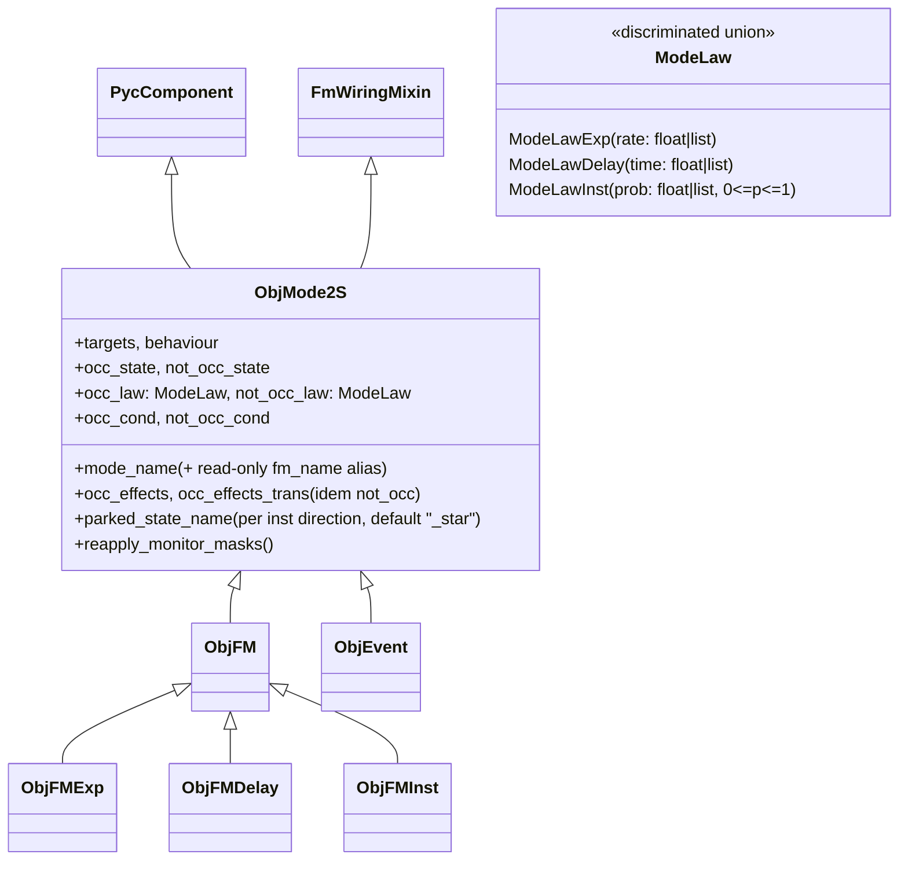

# ✨ ObjMode2S — Generic Two-State Mode Engine

## Enhancement Summary

**Deepened on:** 2026-07-21 — six parallel review agents (Python quality, architecture,
simplicity/YAGNI, performance, pattern consistency, model-integrity), all verified
against the actual code.

### Key corrections to the original plan
1. **Two factual claims fixed**: "inst always active — matches ObjFMInst" was wrong
   (`ObjFMInst.is_occ_law_failure_active` returns `gamma > 0`, component.py:2244);
   and G9 "no error-translation layer" was untenable — existing tests
   `pytest.raises(match=...)` on message substrings ("ObjFMInst", "CCF order", …), so
   **error messages are part of the immutable surface** (Phase 0 inventories them).
2. **Hook-bridge contract written down** (was implicit and would have broken
   third-party Weibull-style subclasses): laws are consumed *only* through hooks;
   `ModeLaw` specs are the default hook implementation; inst routing happens at
   engine level *before* legacy delegation; recursion guard on the delegation
   sandwich.
3. **Wire path fixed before it broke**: `FailureModeBaseSpec` always emits
   `fm_name`/`failure_state`/… kwargs — engine needs the ObjDegMode
   `_BASESPEC_PASSTHROUGH_DEFAULTS` table + wire aliases (`fm_name→mode_name`,
   `failure_cond→occ_cond`) and a read-only `fm_name` property alias (duck-typed by
   `FmWiringMixin._fm_wiring_label` and third-party tooling).
4. **Cuts (YAGNI, verified)**: per-direction interruptible flags removed (every call
   site hard-codes `True`: component.py:1709/1715/1880/1886/904/908); supported-matrix
   tests reduced ~54→~15 cases; `parked_state_name_fmt` mini-API replaced by a plain
   optional name; Phase 0 synthetic-subclass test focused on the one uncovered hook.
5. **New locked decision** (closes a brainstorm open question conservatively):
   **inst on the return direction is rejected with CC order > 1 and with non-internal
   behaviours** — clear construction errors, liftable later.
6. **Performance guards added**: structural-counts + sensitive-method-registration
   baseline (Phase 0 spy), façade≡engine equivalence extended to counts and seeded MC
   event traces, G4 clamp as a single composite predicate, no `_star` machinery for
   timed directions, test-runtime budgets.
7. **Integrity hardening**: unknown-kwargs rejection on the native engine, state-name
   validation + `re.escape` in monitor masks, G3 guard per CC-order pairs with
   `prob ∈ [0,1]` at spec level, `FailureModeParamOverride` no-op fixed, opt-in
   fail-closed runner flag, one doc section listing every known
   silent-wrong-model channel.
8. **Phase reordering**: self-hosted mode + ObjEvent moved *before* the inst
   machinery (validates the new substrate before the riskiest phase); Phase 2 split
   into a mechanical-rename gate and a generalization gate.

---

## Overview

Introduce `ObjMode2S`, a generic two-state mode component (logical states `occ` /
`not_occ`) where **each direction independently carries an `exp`, `delay`, or `inst`
law** (full 3×3 matrix). `ObjMode2S` becomes the engine behind the existing mode-like
classes: `ObjFM`, `ObjFMExp`, `ObjFMDelay`, `ObjFMInst`, and `ObjEvent` are rewritten
as thin backward-compatible **façades** over it. The engine vocabulary is strictly
generic (no failure/repair wording); failure semantics live only in the façades.

**Hard acceptance criterion (from brainstorm):** every currently passing test for the
five façade classes passes **unmodified**. The façade architecture makes this hold by
construction: existing suites keep exercising the façades, which delegate to the
engine.

Locked brainstorm decisions taken as given: full 3×3 law matrix; unified per-edge
`inst` semantics ("one draw per rising edge of the composite guard", auto parking
micro-states suffixed `_star`, masked from sequences); effects (clamps + pulses) and
CC support carried over unchanged with their current validation restrictions;
`inst`/`inst` allowed except the certain livelock; engine-native parameter names
`occ_rate`/`occ_time`/`occ_prob` + `not_occ_*` (façades keep `lambda`/`mu`,
`ttf`/`ttr`, `gamma`); one analytical + targeted MC locks; wire via
`ObjFMGenericSpec`; one-block delivery.

## Problem Statement

The mode family has grown by accretion: `ObjFM` hard-codes one law type per subclass,
`ObjFMInst` overrides `_build_fm_automaton` wholesale to get its 3-state inst
machinery, and `ObjEvent` is a separate hand-rolled 2-state automaton with delay laws
only. Mixed-law modes (exp failure / delay repair, per-demand recovery, …) cannot be
expressed, and each new law combination would today require another subclass with
duplicated wiring. A single law-spec-driven engine removes the duplication and makes
the 3×3 matrix available, while the façade layer preserves every existing model,
study, and test.

## Proposed Solution — Architecture

### Class layout (target state)

### Module placement (decision)

- **New module `cod3s/pycatshoo/mode_law.py`**: `ModeLawExp` / `ModeLawDelay` /
  `ModeLawInst` pydantic specs + `ModeLaw` discriminated union. Pure pydantic, no
  cod3s imports → no cycle risk. Modeled on `DegLaw*` (deg_mode.py:79-116) with:
  an `inst` member (`prob` validated in `[0, 1]`), scalar-or-vector per-CC-order
  normalization, `is_active(order)`, `to_bkd_law(order)`, a module-level
  `TypeAdapter(ModeLaw)` for wire-dict parsing (an annotated union is not
  instantiable directly). Vector-length-vs-order_max validation lives in the
  **engine** (the spec does not know `order_max`).
  *Anti-drift vs `DegLaw`*: share the non-negativity validators (deg_mode may import
  mode_law — unidirectional, no cycle) and add a schema-subset test pinning that
  `DegLaw*` `cls` tags and field names remain a subset of `ModeLaw*`
  (`model_fields` comparison). Full convergence stays deferred; the future friction
  point is direction vocabulary (`occ_/rep_` in DegState vs `occ_/not_occ_`), noted
  in Future Considerations.
- **Engine + façades stay in `component.py`** (in-place refactor of the `ObjFM`
  body). Real constraints (verified): the public third-party import path
  `cod3s.pycatshoo.component`, `system.py:43`, `deg_mode.py:61`, and
  `study_runner.py:310` import the classes from `component`; `sequence.py` imports
  are lazy (not a constraint) but a tail re-export from a new module would be
  import-order fragile. File split deferred; the clean future path (extract
  `PycComponent` to a `component_base.py`, engine as leaf module) is noted in Future
  Considerations so "avoid the cycle" does not fossilize into "never split".
  Constraint to honor now: **engine code never references façade names**, so the
  future split stays mechanical.

### Engine design (extraction, not rewrite)

`ObjMode2S` is produced by **renaming and generalizing the battle-tested `ObjFM`
body** (component.py:935-2087) — the full existing suite is the oracle at every
step. Mapping:

| ObjFM (today) | ObjMode2S engine |
|---|---|
| `fm_name` | `mode_name` (+ read-only `fm_name` property alias — duck-typed by `fm_wiring.py:106-108` and third-party tooling) |
| `failure_state="occ"` / `repair_state="rep"` | `occ_state="occ"` / `not_occ_state="not_occ"` |
| `failure_cond` / `repair_cond` | `occ_cond` / `not_occ_cond` |
| `failure_effects(_trans)` / `repair_effects(_trans)` | `occ_effects(_trans)` / `not_occ_effects(_trans)` |
| subclass law hooks | `occ_law` / `not_occ_law` `ModeLaw` specs as the **default hook implementation** (see hook-bridge contract) |
| `failure_param(_name)` / `repair_param(_name)` per order | law spec carries the per-order vector; param variables `occ_rate`/`occ_time`/`occ_prob` + `__{k}_o_{N}` |
| `get_failure_cond` / `get_repair_cond` (duplicated verbatim, :1911-1997) | single `get_direction_cond(direction, ...)` — a **parametrization of the existing ObjFM code, not a rewrite**; `Direction: TypeAlias = Literal["occ", "not_occ"]` |

Unchanged internals (renamed only): the three behaviours with `ctrl_vars`,
centralized `ctrl_sync`, target automata, `external_rep_indep` guards
(component.py:1602-1909); CC combination loop; `drop_inactive_automata` (decision
routed through the activity hooks — see bridge contract); `cond_inner_logic` /
`cond_outer_logic`; trans-effect validation and wiring via `fm_wiring`;
`trans_name_prefix(_fun)` / `param_name_order_prefix`. Interruptibility is **not**
exposed: every existing call site hard-codes `True`
(component.py:1709/1715/1880/1886/904/908) — `add_aut2st` already takes the flags if
a need ever appears.

**Engine code-quality requirements** (this is the moment — the extraction is worth
nothing if it reproduces the 470-line `__init__`):
- `ObjMode2S.__init__` keyword-only after `mode_name` (`*,`) — brand-new class, no
  legacy constraint.
- **Validate-then-build** (ObjDegMode precedent, deg_mode.py:502-548): (a) full
  fail-fast normalization + validation, (b) dry-run resolution of all
  conditions/effects on all targets, (c) only then create variables/automata,
  decomposed into named `_build_*` methods (`_build_param_variables`,
  `_build_combination_automaton`, `_install_ctrl_sync`, …). Constraint: the legacy
  hook call *order* stays observable by subclasses (pinned in Phase 0).
- **Unknown kwargs rejected** with a `TypeError` listing known fields (ObjDegMode
  precedent deg_mode.py:318-325) — `PycComponent.__init__(**kwargs)` silently
  swallows typos today (`no_occ_law:` would otherwise build a wrong model with the
  default return law). Façades keep their historical passthrough.
- **State-name validation**: configured state names, generated parked names, and
  automaton names must match `^[A-Za-z_][A-Za-z0-9_]*$` and be mutually distinct;
  `re.escape` wherever names are interpolated into monitor masks / filter patterns.
- **Full type hints** on the engine public API and hooks (`Callable[[], bool]`
  conds, records aliases); the legacy body has none — "mypy on touched files" must
  mean something.
- Native laws are **required**: a missing `occ_law` raises a clear `ValueError`,
  never `AttributeError` (the abstract-by-convention trap stays confined to the
  legacy façade layer; `ObjFMInst.set_occ_law_failure`'s `NotImplementedError` stays
  in the façade).
- Error messages embed the *configured* state names + the component label. Messages
  asserted by existing tests (`match=` inventory, Phase 0) stay verbatim **at façade
  level** — engine messages are generic, façade validation overrides keep the
  historical wording. (Corrects the original G9 "no translation layer".)

**Hook-bridge contract** (the compat-critical piece, now explicit):

1. The engine consumes laws **only** through its template hooks
   (`_direction_law_bkd(direction, params) -> dict`, `_is_direction_law_active`,
   `_default_direction_param_names`, `get_direction_cond`, `_build_mode_automaton`,
   `_create_target_automaton`). Hook names avoid the ambiguous "occ_law" wording
   (legacy `set_occ_law_repair` means "occurrence law of repair" — the
   correspondence table goes in the docstring and docs).
2. `ModeLaw` specs are the **default implementation** of those hooks. Third-party
   laws (Weibull, …) are *not* `ModeLaw` members — they keep flowing as backend
   law dicts through overridden hooks; `occ_law`/`not_occ_law` may be `None` in
   that case.
3. **Inst routing happens at engine level, before any legacy delegation**: the
   3-state machinery is triggered exclusively by `isinstance(law, ModeLawInst)` on
   a present spec. A hook-driven direction always takes the 2-state path. (Without
   this rule the ObjFMInst façade would fall back to the 2-state build.)
4. The `ObjFM` façade implements the engine hooks by delegating to the legacy-named
   hooks (`set_occ_law_failure`, `set_default_failure_param_name`,
   `is_occ_law_failure_active`, `get_failure_cond`, … — call sites
   component.py:1296-1733) via a direction dispatch table resolved **at build time**
   (no per-evaluation dispatch on the simulation hot path). The
   old-signature `_build_fm_automaton` tolerance (trans-kwargs only when non-empty,
   :1566-1573, commit 32c3165) is preserved; the default `_build_fm_automaton` body
   calls the engine implementation via a **qualified call**
   (`ObjMode2S._build_mode_automaton(self, ...)`) to prevent recursion when both
   hooks are overridden.
5. **Drop decisions** (`drop_inactive_automata`) route through the activity hooks so
   façade behaviour is unchanged: `ObjFMExp` drops on `rate <= 0` (:2109),
   **`ObjFMInst` drops on `gamma <= 0`** (:2244 — the original plan text was wrong),
   `ObjFMDelay` never drops. Native rules live on the law spec: exp active iff
   `rate > 0`; delay always active (time 0 is a valid delay); inst always active
   (prob 0 is a valid never-drawing mode — a *native-vs-façade divergence by
   design*, pinned by a test). Param variables keep being created **before** the
   drop `continue` (study indicators reference them even for dropped automata).

**Self-hosted mode (no targets)** — an explicit second build path, not a degenerate
case (verified: `ObjFM(targets=[])` today builds a silent dead component — zero
automata; the CC loop never runs):
- Activated **explicitly** (`targets=None` → self-hosted; `targets=[]` keeps the
  legacy silent no-op **through the ObjFM façade**, pinned in Phase 0; the façade
  never activates self-hosted mode).
- Own builder (`_build_self_automaton`), automaton name via an `aut_name` parameter
  (matching `add_automaton` vocabulary; the ObjEvent façade maps `event_aut_name`
  onto it), component named by its bare `name` (no `{target}__{mode}` composition).
- Validation matrix: behaviour ≠ internal, CC options, per-order vectors → rejected
  with clear errors, never silently ignored.
- Zero-overhead contract: no param variables, no sensitive methods (pinned by the
  ObjEvent characterization — today's ObjEvent registers none; `tempo_*` are law
  literals).

**Generic inst machinery (absorbed from ObjFMInst, component.py:2299-2401):** when a
direction's law is `ModeLawInst`, the engine splits the source logical state into
*armed* + *parked* micro-states, builds the draw (branch order `[dest, parked]`,
prob re-bound to the parameter variable post-build, :2382), the `inst p=1` re-arm on
the negated condition, and the monitor masks (draw `#<dest>$` with `re.escape`,
re-arm `#$^`); `_monitor_masks` + `reapply_monitor_masks()` live on the engine
(runner duck-types it, study_runner.py:711-714). Parked-state naming: plain optional
`parked_state_name` per direction, default computed `f"{source_state}_star"` (no
format-string mini-API). **Timed directions never get `_star` states or re-arm
transitions** (pinned by test). G4 clamps: a logical state's level effects apply in
both micro-states via **one** sensitive method with a composite
armed-OR-parked predicate — never two registrations per variable
(`_wire_state_effects` registers on automaton + each variable + start + step;
doubling it would be a per-fixpoint-pass cost on every MC run).

### Immutable compatibility surface (verified against code)

1. **Class identity & lineage** — `isinstance(comp, ObjFM)` / `isinstance(comp,
   ObjEvent)` hard-checked by sequence discovery (sequence.py:1310-1384) and
   `system.add_targets` (system.py:373); string class names resolve through
   `PycComponent.from_dict`/`get_subclasses` (component.py:76-85). All five classes
   keep `__name__`, lineage, and importability from `cod3s.pycatshoo.component`.
2. **Discovered attributes** — ObjFM: `failure_state`, `repair_state`, `behaviour`,
   `fm_name`; ObjEvent: `occ_state_name`, `not_occ_state_name`, `event_aut_name`.
3. **Subclass hook protocol** — the hooks listed in the bridge contract, same
   names, signatures, and **call order with the same partial-init state visible at
   each call** (e.g. `set_default_failure_param_name` at :1296 sees
   `fm_name`/`targets`/`behaviour` but not yet `param_name_order_prefix`, set at
   :1305). Pinned by a Phase 0 recording test.
4. **Observable name grammar** — component `{target_name}__{fm_name}` with
   `_factorize_target_names`; automata `frun`, `frun__cc_1_2`, …;
   states/transitions `occ`, `rep`, `occ__cc_1_2`, …; param variables
   `lambda`/`mu`/`ttf`/`ttr`/`gamma` with `__{order}_o_{order_max}` suffix (bare at
   order_max==1); external target prefix `{fm_name}__{state}`; ObjEvent automaton
   `ev`, transitions literally `occ`/`not_occ`, target string `{name}.occ`.
5. **ObjFMInst exact 3-state grammar** (G1): physical states `rep` (armed), `occ`,
   `not_occ` (**parked** — `f"not_{failure_state}"`, :2317), init `rep`; draw named
   `occ`, branches `[occ, not_occ]`, mask `#occ$`; re-arm named `not_occ`, mask
   `#$^`; repair named `rep`; per-cc suffixed variants. Façade config:
   `not_occ_state="rep"`, `parked_state_name="not_occ"`, occ param base `gamma`,
   return exp base `mu`. Docs get a dedicated mapping line: *ObjFMInst `not_occ` =
   parked(occ direction) ≠ engine `not_occ`*.
6. **Error-message strings asserted by tests** — `pytest.raises(match=...)`
   inventory (e.g. `test_objfm_trans_effect.py`: "ObjFMInst", "CCF order",
   "silently overwritten"; `test_comp_failure_external_modes_errors.py`:
   "behaviour", "frun", "order"; `test_objfm_unknown_var.py`: variable names).
   Collected by a Phase 0 grep; façade-level validation keeps these verbatim.
7. **Structural counts** (perf surface): per-façade automata/states/transitions/
   variables counts **and sensitive-method / start-method / step-method registration
   counts** — baselined in Phase 0 via a monkeypatched spy, re-asserted by the
   equivalence tests. Grammar pins alone cannot catch a per-step cost regression.
8. **Spec/registry surface** — `_FM_REGISTRY` names (study_runner.py:313-323), the
   spec classes (study_yaml.py), `system.add_events` (system.py:352-362),
   `add_targets`' `isinstance(ObjEvent)` + literal `.occ` path.

### Wire path (ObjFMGenericSpec) — resolved before it breaks

`FailureModeBaseSpec.model_dump` always emits `fm_name`, `targets`,
`failure_state="occ"`, `repair_state="rep"`, `failure_cond=True`,
`behaviour="internal"`, `enabled`, … and the runner calls `fm_cls(**spec_dict)`
(study_runner.py:378-402 — which also logs `spec.fm_name`). A strictly generic
constructor would `TypeError` — **swallowed by the runner**. Therefore the engine
constructor ships (from Phase 2, not Phase 6):
- wire aliases `fm_name → mode_name` and `failure_cond → occ_cond`;
- an engine-native `_BASESPEC_PASSTHROUGH_DEFAULTS` table (ObjDegMode precedent,
  deg_mode.py:251-345): two-state legacy fields tolerated at their BaseSpec
  defaults, rejected with a clear `ValueError` on any explicit non-default —
  never silently ignored;
- string conditions rejected (the runner never resolves them — ObjDegMode
  hardening precedent). While in `study_runner.py`, fix the stale docstring
  claiming an `issubclass(fm_cls, ObjFM)` check (none exists; ObjDegMode is already
  a registered non-subclass).

### Sequence discovery (G2)

`_discover_objfm_specs` (sequence.py:1310) gains a bare-engine branch with explicit
façade exclusion — after the refactor both `ObjFM` and `ObjEvent` are `ObjMode2S`
subclasses, so the branch must be
`isinstance(comp, ObjMode2S) and not isinstance(comp, (ObjFM, ObjEvent))` (or
façade branches checked first), otherwise façades get double-filtered. The bare
branch reads `occ_state`/`not_occ_state`/`behaviour`/`mode_name` and reuses the
internal/external patterns. *Scope note:* this item serves neither hard constraint
(no existing test, façade lineage covers the locked ObjEvent parity) — it is kept
because native `ObjMode2S` is billed as first-class, and it is the **designated
deferral valve** if capacity runs short (drop it and its acceptance criterion
together).

### Remaining resolved review gaps

- **G3 (inst/inst livelock guard)** — construction `ValueError` when an occ-side
  and return-side prob are both 1 **for any CC-order pair** and both conditions are
  the literal `True` (identity check `cond is True`, not truthiness); warning
  otherwise when both are 1. `ModeLawInst` validates `prob ∈ [0, 1]` at spec level
  (the wire-level check in `ObjFMInstSpec` is bypassed by native construction).
  Runtime overrides to 1/1 are not guarded — documented, with the symptom named
  (a `stepForward` hang), plus the near-1 cost note: same-instant chain length is
  geometric with mean `1/(1−γ_occ·γ_ret)`.
- **G4 (`_star` clamp semantics)** — clamps span both micro-states (single
  composite-predicate method, see above). The claimed unobservability for ObjFMInst
  (`repair_effects` not clamped on today's parked `not_occ`) is **verified
  empirically in Phase 0** (grep tests for non-empty `repair_effects` on ObjFMInst;
  one-off experiment on master if any) rather than assumed.
- **G5** — `cond ≡ True` "immediately or never" stays a documented pattern, no
  warning.
- **G6 (padding & activity)** — engine-native: strict lengths, no silent padding;
  façades keep `(0,)` padding inside their `set_default_*_param` hooks. Activity
  rules per bridge-contract item 5 (corrected).
- **G11 (isimu inst/inst cascade)** — regression test that a same-instant pending
  created by a submitted branch is re-surfaced; fix the pending loop only if red.
- **Condition compilers** — there are already three near-copies (ObjFM's duplicated
  pair :1911-1997, ObjEvent's inline closure :868-894, `deg_mode.compile_condition`
  :183-229). This chantier dedupes ObjFM's pair into `get_direction_cond`
  (parametrization, not rewrite) and keeps ObjEvent's compilation in its façade
  (G8); the native engine path **raises** on unknown condition shapes (the legacy
  path silently treats a string as truthy — Phase 0 checks no test depends on that
  laxity). Full convergence on a shared compiler (seeded from the deg_mode version,
  relocated to `common.py`) goes to Future Considerations.

## Implementation Phases

One feature branch (`feat/objmode2s`), full suite green at every gate, **single
merge to `master` at the end**. Never edit an existing test file — they are the
oracle.

### Phase 0 — Characterization & baselines

- [x] `tests/pyc_obj/obj_event/test_objevent_contract.py` (new — the directory has
      **no live tests**, only stale untracked `.pyc`): construction with defaults
      and custom names, automaton structure (`ev`, states, init `not_occ`), both
      delay laws + `tempo_*` values, transition names `occ`/`not_occ`,
      cond/negation, `cond_operator`/`cond_value`, `{name}.occ` targetability, and
      the **zero-overhead pins**: no param variables, no sensitive-method
      registrations.
- [x] `tests/pyc_obj/obj_fm/test_objfm_subclass_compat.py` (new): synthetic
      subclass overriding `_build_fm_automaton` **with the pre-trans-effects
      signature** (the one hook the in-repo subclasses don't exercise), plus a
      **hook-call recording** pinning call order and attribute availability at each
      hook. (Law/param/cond hook overrides are already exercised by
      ObjFMExp/Delay/Inst at every gate.)
- [x] Pin `ObjFM(targets=[])` = silent no-op (zero automata) through the façade.
- [x] Inventory `pytest.raises(match=...)` strings across `tests/` → immutable
      message list (surface item 6).
- [x] Grep for non-empty `repair_effects` on ObjFMInst in tests/examples (G4
      verification); one-off master experiment if any found.
- [x] Check no test depends on the legacy silent-truthy string-condition laxity.
- [x] **Baselines** on master: structural counts + sensitive/start/step-method
      registration counts (monkeypatched spy) for one model per façade (incl. CCF
      order 3 with an inactive order, external, external_rep_indep, ObjFMInst CCF,
      ObjEvent); seeded 1000-run MC wall-time smoke (objfm_exp_demo-like model);
      full-suite wall-time (`--runslow --durations=20`).

**Gate:** new tests green on master's code; baselines recorded.

### Phase 1 — Law specs (`mode_law.py`)

- [x] Module as specified above (union, TypeAdapter, `prob ∈ [0,1]`, activity
      rules, `to_bkd_law`, shared validators importable by deg_mode).
- [x] `tests/pyc_obj/test_mode_law.py`: validation matrix, vector handling,
      activity rules, dict round-trip, **DegLaw schema-subset anti-drift test**.

**Gate:** unit tests green; no production code touched.

### Phase 2 — Engine extraction + timed-law façades

- [x] **2a — mechanical extraction**: `ObjMode2S` = renamed ObjFM body (mapping
      table), `ObjFM` = near-alias façade; no new features, targets semantics
      unchanged. *Gate: full suite green* — including `test_objfm_inst_*`, whose
      wholesale `_build_fm_automaton` override **must survive via the old-signature
      tolerance** (stated requirement, not an accident).
- [x] **2b — generalization**: law-spec-driven native path (hook-bridge contract
      items 1-5), validate-then-build decomposition, keyword-only signature,
      unknown-kwargs rejection, state-name validation, wire aliases +
      `_BASESPEC_PASSTHROUGH_DEFAULTS`, `fm_name` property alias, typing,
      `get_direction_cond` dedupe. Build-time-resolved delegation only (no
      per-evaluation dispatch — condition-closure depth unchanged vs today).
- [x] `tests/pyc_obj/obj_mode2s/test_mode2s_core.py` (+ `_utils.py` on the
      obj_deg_mode model): native construction (occ/not_occ grammar,
      `occ_rate`/`not_occ_time` variables), and the **façade ≡ raw-engine
      equivalence test**: same automata/states/transitions/variables, same
      sensitive-method registration counts, same deterministic isimu cycle, and a
      **seeded MC run with strict event-trace equality** (ObjFMExp vs hand-built
      ObjMode2S — the strongest anti-drift check available).
- [x] Re-run the Phase 0 MC wall-time smoke (soft threshold ×1.3).

**Gate:** full existing suite green unmodified + new tests + baseline counts match.

### Phase 3 — Self-hosted mode + ObjEvent façade + discovery

- [x] Self-hosted build path (`_build_self_automaton`, explicit activation,
      naming, validation matrix, zero-overhead contract).
- [x] `ObjEvent` façade: cond compiled in the façade exactly as today, then
      `occ_cond=cond_fun` / `not_occ_cond=lambda: not cond_fun()`; `tempo_*` →
      `ModeLawDelay`; naming mapped. Replace `getattr(builtins, inner_logic)`
      (:862-864) with a `{"all": all, "any": any}` lookup + `ValueError` (only
      documented values; kills the `"breakpoint"`/`"sum"` footgun). Drop the
      commented-out `sanitize_cond_format` dead block (:911-932) — do not recopy.
      `EventSpec` / `add_events` / `add_targets` untouched.
- [x] Sequence discovery: bare-engine branch with façade exclusion (see design);
      regression tests for façade discovery + bare occ/not_occ cycle collapse in
      `tests/pyc_obj/obj_mode2s/test_mode2s_sequence_filter.py`.

**Gate:** Phase 0 characterization + `test_pyc_sequence_filter_objevent.py` +
`test_pyc_sequence_filter_objfm.py` green unmodified.

### Phase 4 — Generic inst machinery + ObjFMInst façade

- [x] Absorb the 3-state build into the engine (inst routing before legacy
      delegation; parked naming; branch order `[dest, parked]`; prob re-binding;
      masks with `re.escape`; engine-level `_monitor_masks` +
      `reapply_monitor_masks`); symmetric return direction (`occ_star`); composite
      armed-OR-parked clamp predicate; **no `_star`/re-arm for timed directions**
      (pinned).
- [x] `ObjFMInst` façade: inst occ law (base `gamma`), exp return (base `mu`),
      `not_occ_state="rep"`, `parked_state_name="not_occ"`; **deletes** its
      `_build_fm_automaton` override; keeps its trans-effects rejection (verbatim
      messages) and `get_*_cond` overrides; drop-on-`gamma<=0` behaviour preserved
      via its activity hook (+ test pinning the native-inst-vs-façade drop
      divergence).
- [x] `tests/pyc_obj/obj_mode2s/test_mode2s_inst.py`: brainstorm scenarios A–D on
      the **return** direction (per-demand recovery, `occ_star` parking, re-arm,
      entry-with-cond-true, `cond≡True` immediate-or-never), `_star` naming, masks,
      clamps-during-parking pin.

**Gate:** `test_objfm_inst_001/002_ccf/003_mc` green unmodified + new inst tests.

### Phase 5 — New combos, locks, isimu

- [x] **Reduced validation matrix** (~15 cases, not 54): parametrized sweep of the
      9 law cells at `internal`/order 1 (construct or reject, **rejections asserted
      at construction without simulating**); targeted cells where law type meets
      machinery — **new locked decision: inst-on-return is rejected with CC
      order > 1 and with `external`/`external_rep_indep`** (clear errors, liftable
      later); inst×CC on the occ side (exists today via ObjFMInst — kept); G3
      prob-1 rule per CC-order pairs.
- [x] Deterministic isimu tests for the accepted mixed combos (exp/delay,
      delay/exp, delay/inst, inst/delay, exp/inst — internal, order 1).
- [x] Statistical locks (`--runslow`, `@pytest.mark.slow`, seeded, ≤ ~2 min total
      added):
      - **Analytical (non-circular):** exp/delay alternating renewal — asymptotic
        availability `(1/λ)/(1/λ + ttr)` (degmode CTMC-lock pattern).
      - **MC inst-return:** periodic crew cycle, `γ_ret = 0.5` (≥ 0.3 — run count
        and t_max blow up in `1/γ`), 2000–4000 runs — mean repair-visit count
        `≈ 1/γ_ret` within 3σ.
      - **MC inst/inst termination:** overlapping conds, γ=0.5 both sides —
        anti-hang guard **plus a per-run sequence-length bound** (a Zeno
        regression shows up as event-count explosion before it shows up as a
        hang).
- [x] isimu inst/inst cascade regression test (G11).

**Gate:** full suite + new suites green; slow locks green under `--runslow` within
budget (`--durations` vs Phase 0 baseline).

### Phase 6 — Integration, overrides, docs, release prep

- [x] Registry: `"ObjMode2S"` in `_populate_default_fm_registry`; specs-runner test
      through `ObjFMGenericSpec` (routing, round-trip, swallowed-error count
      assertion, event-grammar contract — degmode precedent).
- [x] **`FailureModeParamOverride` hardening** (study_runner.py:490-507): today it
      `setattr`s `failure_param`/`repair_param` post-build — on a native ObjMode2S
      that would create a dangling attribute and **log success while changing
      nothing**. Fix: verify the target attribute pre-exists, propagate to the
      backend parameter *variables* (the law→variable re-binding exists precisely
      for this), warn/raise otherwise. Verify the façade path actually works today
      while at it.
- [x] **Opt-in fail-closed runner flag** (`strict_failure_modes`, default `False`
      to preserve pinned swallow behaviour): when set, abort the study if
      `added != enabled` failure modes. Documented as the recommended setting —
      without it, every construction-time guard in this plan is reduced to a log
      line on the wire path.
- [x] Docs: `docs/user-guide/obj-mode-2s.md` — locked inst-semantics section +
      diagram from the brainstorm, 3×3 matrix table with per-combo status
      (supported / rejected-with-error), façade↔engine mapping table
      (`lambda↔occ_rate`, `gamma↔occ_prob`, hook correspondence, the ObjFMInst
      `not_occ`-is-parked line), `cond≡True` pattern, and a single **"silent
      wrong-model channels" caveat section** (runner swallow + strict flag,
      `drop_inactive_automata` runtime no-op, prob-1 runtime override → hang
      symptom, `add_targets` splat). Update `objfm-inst.md` (internals moved);
      `mkdocs.yml` nav; `CLAUDE.md` (architecture + example listing).
- [x] Example: `examples/objmode2s_demo/` — per-demand recovery walkthrough
      (scenario D, maintenance-crew inst return) runnable in `cod3s-isimu` with
      inline expected timeline.
- [x] Housekeeping while in the area: `ipdb` comments (:1216, :1246-1247); mutable
      defaults in `_factorize_target_names` (:2015 — lists → tuples); E731 lambdas
      (:1550); `target_name` loop-shadowing (:1591); optional conservative
      memoization of the external-cond state lookup (`make_external_cond`
      :1508-1526 re-resolves `get_state_by_name` per evaluation — cache the `_bkd`
      handle at first call; validated by the wall-time smoke).
- [x] Local validation: full `pytest` + `--runslow`, `black`/`isort`/`flake8`,
      `mypy cod3s/` on touched files, `mkdocs build`.
- [x] Suggest merge to `master` when validated (no PR — solo workflow); version
      bump (1.14.0) is Roland's call at release time.

**Gate:** everything green; docs build; demo runs.

## Acceptance Criteria

### Functional
- [x] Entire pre-existing test suite passes **with zero test-file modifications**.
- [x] Native `ObjMode2S` supports the 3×3 matrix per the validation matrix
      (construct or clearly reject — never a silent wrong model); inst-on-return
      restricted to internal/order-1 (locked decision).
- [x] Unified inst semantics verified on both directions (scenarios A–D), `_star`
      naming and masking per brainstorm; timed directions build no inst machinery.
- [x] Façade ≡ raw-engine equivalence (structure, counts, seeded MC traces).
- [x] Bare `ObjMode2S` cycles collapsed by `SequenceAnalyser` (deferral valve if
      capacity requires — drop with its criterion); façade discovery unchanged.
- [x] `ObjMode2S` creatable via study.yaml (aliases + passthrough table) and
      drivable in `cod3s-isimu`, including same-instant inst cascades.

### Non-functional / quality gates
- [x] Statistical locks green (analytical exp/delay renewal; MC inst-return; MC
      inst/inst termination with sequence-length bound) within the runtime budget.
- [x] Structural-count and sensitive-method-count parity vs Phase 0 baselines;
      MC wall-time smoke within ×1.3.
- [x] Subclass compat test (old-signature `_build_fm_automaton`, hook order) green.
- [x] `black`, `isort`, `flake8`, `mypy` (touched files), `mkdocs build` clean.
- [x] Docs page + demo delivered; CLAUDE.md updated.

## Dependencies & Risks

| Risk | Mitigation |
|---|---|
| Observable-name **and error-message** drift breaks tests/studies | Frozen-grammar + `match=` inventory (surface items 4-6), suite-as-oracle, no-test-edit rule |
| Third-party ObjFM subclass breakage (hooks) | Explicit bridge contract (routing, recursion guard, call-order pin) + Phase 0 compat test |
| ObjFMInst parked `not_occ` vs engine `not_occ` collision | Configurable parked name; exact 3-state reproduction (surface item 5); docs mapping line |
| ObjEvent has no live tests | Phase 0 characterization suite incl. zero-overhead pins |
| Wire path TypeErrors swallowed by runner | Aliases + passthrough table from Phase 2; specs-runner count assertions; opt-in strict flag |
| Per-step cost regression invisible to naming tests | Structural + sensitive-method count baselines, build-time-resolved delegation, composite clamp predicate, wall-time smoke |
| `isinstance` discovery double-filters façades (now ObjMode2S subclasses) | Explicit façade-exclusion rule + regression tests |
| inst/inst same-instant chains stress stepper / TUI | Sequence-length bound in MC lock; isimu cascade test; near-1 cost documented |
| Import cycles from module split | Engine stays in `component.py`; only pure `mode_law.py` new; engine never references façade names |
| ModeLaw/DegLaw drift | Shared validators + schema-subset test |
| Big-bang refactor of a 2400-line module | 2a/2b split (mechanical rename gated separately), phase gates, extraction-not-rewrite, single-block merge at the end |

Dependencies: none external. Python 3.10.18 / PyCATSHOO binary constraint unchanged.

## Future Considerations (out of scope, noted)

- `ObjDegMode` convergence: `DegLaw*` → `mode_law.py` migration is trivial; the
  direction-vocabulary migration (`occ_/rep_` in DegState vs `occ_/not_occ_`) is
  not — that's the friction point to plan for. `_factorize_target_names` could move
  to `fm_wiring.py` as a shared brick.
- File split of `component.py`: extract `PycComponent` to a base module, engine as
  leaf, `component.py` as pure re-export — mechanical once engine code references
  no façade names.
- Shared condition compiler (seeded from `deg_mode.compile_condition`, relocated to
  `common.py`) replacing the remaining variants.
- Dedicated typed wire spec for ObjMode2S once it is the dominant study API.
- Lifting the carried-over restrictions: trans-effects (CCF, inst), inst-on-return
  × CC/behaviours.
- `strict_failure_modes` default flip to `True` at a major version.

## References

- Brainstorm (locked decisions + inst semantics diagram):
  `docs/brainstorms/2026-07-20-objmode2s-brainstorm.md`
- Engine source to extract: `cod3s/pycatshoo/component.py:935-2418` (ObjFM :935,
  hooks :1296-1733, activity overrides :2109/:2244, ObjFMExp :2089, ObjFMDelay
  :2144, ObjFMInst :2171 + build :2299-2401 + parked naming :2317, ObjEvent
  :828-932 + builtins lookup :862-864)
- Shared bricks: `cod3s/pycatshoo/fm_wiring.py` (`FmWiringMixin` incl.
  `_fm_wiring_label` :106-108, `order_param_name`, `cc_comb_suffix`,
  `_wire_state_effects` :149-190)
- Precedents: `cod3s/pycatshoo/deg_mode.py` (:79-116 DegLaw, :183-229
  compile_condition, :251-345 BaseSpec passthrough, :318-325 kwargs rejection,
  :502-548 validate-then-build), `tests/pyc_obj/obj_deg_mode/`
- Sequence discovery/filtering: `cod3s/pycatshoo/sequence.py:1127-1460`
- Wire/registry/overrides: `cod3s/specs/study_yaml.py` (`FailureModeBaseSpec` :71,
  `ObjFMGenericSpec` :279, `EventSpec` :351),
  `cod3s/scripts/study_runner.py:298-351, 378-402, 490-507, 711-714`
- Naming/message-contract tests: `tests/pyc_obj/obj_fm/test_objfm_inst_002_ccf.py`,
  `test_comp_failure_003/004/007.py`, `test_objfm_trans_effect.py`,
  `test_comp_failure_external_modes_errors.py`,
  `tests/pyc_obj/test_pyc_sequence_filter_objevent.py`
